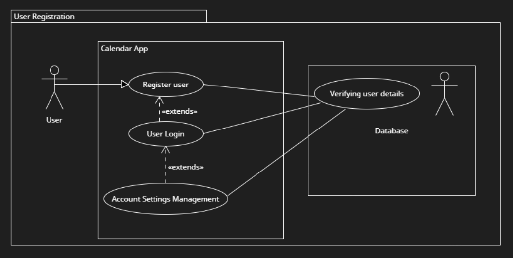
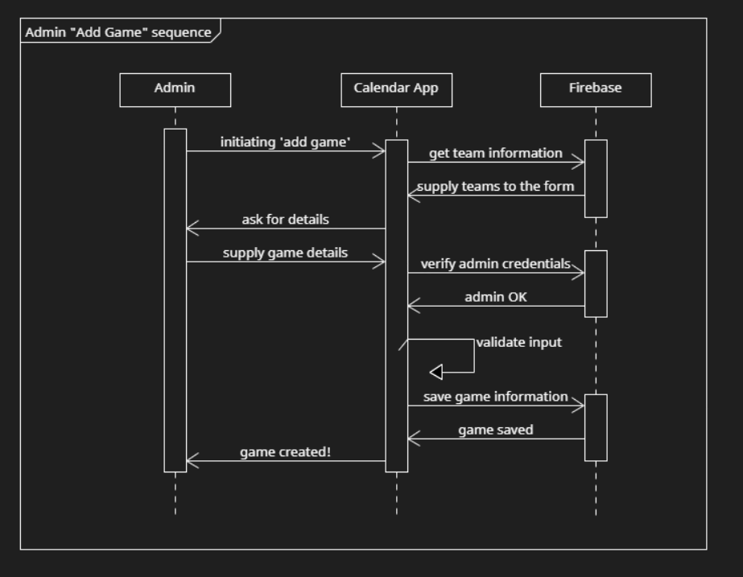
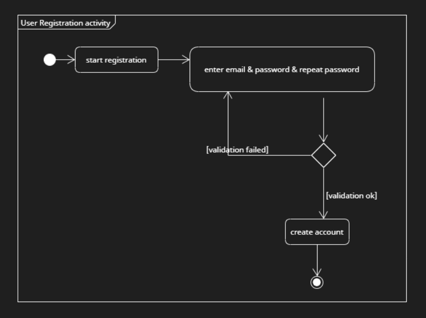

# System design

### Functional requirements

#### User Registration:

Users can create accounts with unique credentials (email/password).

#### Monthly View:

Display a monthly calendar showing the number of games per night.
Highlight days with scheduled games.

#### Detailed Game List:

Upon selecting a day, present a list of games scheduled for that day.
Include details like teams playing, time, and venue.
Favorites Feature:
Allow users to mark specific games or teams as favourites for easy access.

#### Email Alerts:

Enable users to set up email alerts for upcoming games they are interested in.

#### Admin Functions:

Admins can add new games to the calendar.
Admins can add new teams to the app.

#### Game results:

After a game is finished, the results of the game should be updated on the app via web scraping.

---

### Epics

- **User authentication and management**: Users should be able to register accounts, and then login, and manage their account settings once logged in. There should be different roles assigned with admin privileges allowing the adding of games.
- **Game Management**: Logged in users should be able to favourite a game. Admins should be able to add new games and teams, adjust existing ones and delete cancelled games.
- **Notification and Alerts**: Users should be able to receive email alerts for their favourited games.
- **Game overview & display**: A monthly overview should show the number of games per game day. App users should be able to go back and forth to different months and click on specific days to view that day’s scheduled games.

---

### Use cases

#### User Login

User story: As a user, I want to be able to login.  
Description: Allows registered users to access the application by entering their credentials.  
Actor: Registered User  
Triggering Event: User attempts to access the application.  
Related Use Cases: Account Settings Management

#### User Registration

User story: As a visitor to the site, I want to be able to sign up for a new account.  
Description: Enables new users to create an account to access the app's functionalities.  
Actor: New User  
Triggering Event: Visitor wants to become a registered user.  
Related Use Cases: User Login

#### Account Settings Management

User story: As a user, I want to be able to modify my account details.  
Description: Permits logged-in users to modify their account details, preferences, and profile information.  
Actor: Logged-in User  
Triggering Event: User wishes to update account information.  
Related Use Cases: User Login

#### Add New Game

User story: As an admin, I want to be able to add a new game.  
Description: Allows admins to incorporate a new game into the calendar, specifying teams, date, time, and location.  
Actor: Admin  
Triggering Event: Admin plans to include a new game in the calendar.  
Related Use Cases: Add New Team

#### Add New Team

User story: As an admin, I want to be able to add a new team.  
Description: Enables admins to add a new team to the app's database.  
Actor: Admin  
Triggering Event: Admin needs to include a new team in the system.  
Related Use Cases: Add New Game

#### Favorite a Game

User story: As a logged in user, I want to be able to favourite a game.  
Description: Permits logged-in users to mark a game as a favourite for easy tracking.  
Actor: Logged-in User  
Triggering Event: User decides to mark a specific game as a favourite.  
Related Use Cases: None

#### Email Alerts for Favourited Games

User story: As a user I should be able to get email alerts for favourited games.  
Description: Allows users to receive email notifications regarding updates on favorited games.  
Actor: User  
Triggering Event: User wishes to stay informed about changes in favorited games.  
Related Use Cases: None

#### Overview of Games for Current Month

User story: As a visitor on the site, I should be able to see and overview of games per the current month.  
Description: Provides visitors or users with a summary of games scheduled for the present month.  
Actor: Visitor/User  
Triggering Event: Visitor/User wants an overview of games in the current month.  
Related Use Cases: None

---

# UML

